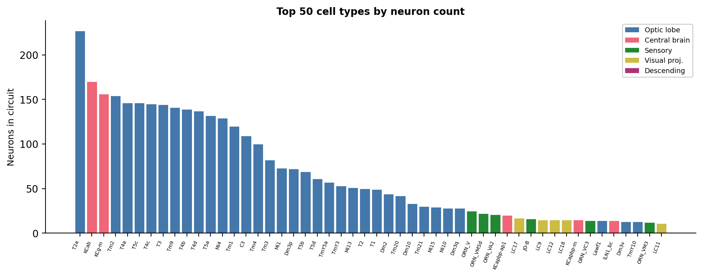
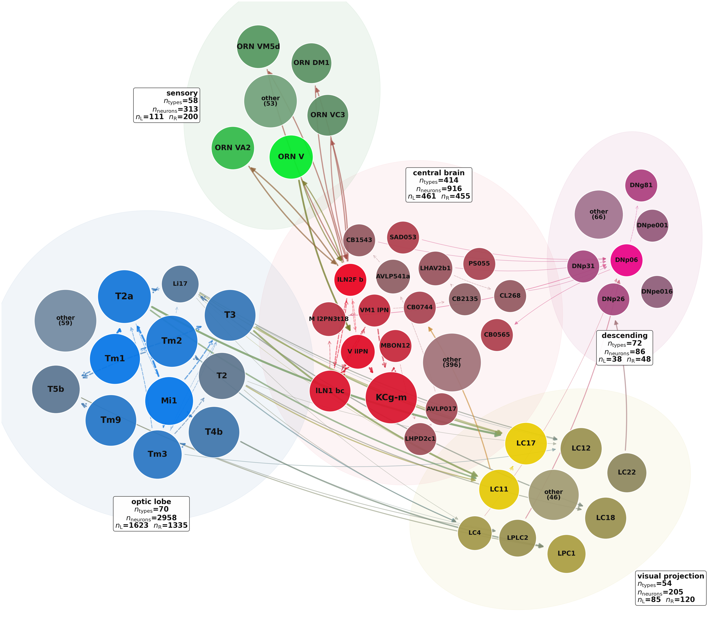
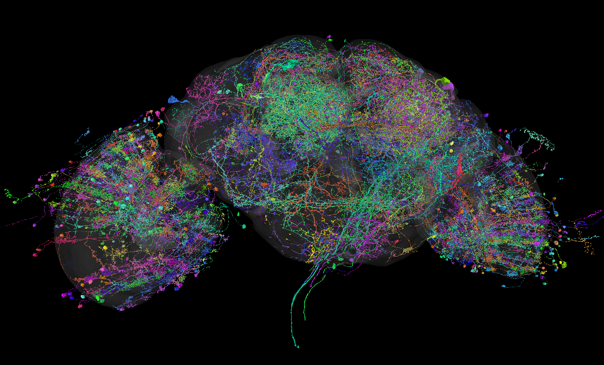

# Largest Shared Neural Circuit - Biological Interpretation

FlyWire Qualification Challenge, June 2026 - Francesco Correnti

## Definitions

- **Circuit** - the largest connected directed induced subgraph found to be isomorphic across the three datasets (FAFB, BANC, Male CNS). It contains N = 4,485 neuron triplets.
- **Cell type** - a neuronal identity label (e.g. Mi1, KCab) shared across datasets; neurons of the same cell type are treated as interchangeable for matching purposes.
- **Class** - a coarse brain-region category to which each cell type belongs. Five classes appear in the circuit:
**optic lobe (OL)** ·
**central brain (CB)** ·
**sensory (SE)** ·
**visual projection (VP)** ·
**descending (DN)**
- **Type graph** - a directed graph whose nodes are cell types and whose edges represent conserved synaptic connectivity (an A → B edge exists iff at least one A → B cell-level edge is present in each of the three datasets). The full type graph has 5,116 nodes and ~45,000 edges.
- **Circuit type graph** - the subgraph of the type graph restricted to the 673 cell types present in the circuit (673 nodes, 1,133 edges). Unless stated otherwise, degree and topology metrics in this document refer to this restricted graph.
- **Neuron triplet** - a matched set of three neurons (one per dataset) of the same cell type, occupying one slot in the circuit.
- **ORN** - olfactory receptor neuron. **lLN** - local interneuron (antennal lobe). **PN** - projection neuron. **KC** - Kenyon cell. **MBON** - mushroom body output neuron. **VPN** - visual projection neuron.

## Results

The circuit contains **4,485 neuron triplets**, **673 cell types**, and **5,450** directed edges.

| Class | *n* | % | L/R |
| --- | ---: | ---: | ---: |
| Optic lobe | 2958 | 66.0 | 1623/1335 |
| Central brain | 916 | 20.4 | 461/455 |
| Sensory | 313 | 7.0 | 111/200 |
| Visual projection | 205 | 4.6 | 85/120 |
| Descending | 86 | 1.9 | 38/48 |
| Other† | 7 | 0.2 | 5/2 |
| **Total** | **4485** | | **2323/2160** |

† Visual centrifugal (5), motor (1), ascending (1).

Two thirds of the circuit sits in OL. This is not surprising: OL neurons are arranged in repeated columns with near-identical wiring, so the isomorphism constraint is easy to satisfy there. SE, VP, and DN together make up only 13.5% of neurons, but they carry most of the inter-class signal flow (see flow matrix below). Hemispheric balance is near-symmetric (L 2323 / R 2160), and 86.8% of edges are ipsilateral.

## Graph topology

The circuit type graph has 673 nodes and 1,133 directed edges. Feedforward loops outnumber 3-cycles 407:153 (ratio 2.7:1), so the overall architecture leans heavily feedforward. Only 94 edge pairs (8.3%) are reciprocal, and most of those sit at the CB-SE interface (38 pairs, the ORN-lLN back-and-forth in the antennal lobe) or within CB itself (33 pairs).

The inter-class flow matrix is almost strictly feedforward:

| From ↓ / To → | OL | CB | SE | VP | DN |
| --- | ---: | ---: | ---: | ---: | ---: |
| OL | - | 0 | 0 | 454 | 0 |
| CB | 0 | - | 215 | 6 | 162 |
| SE | 0 | 257 | - | 0 | 26 |
| VP | 5 | 55 | 0 | - | 37 |
| DN | 0 | 27 | 0 | 0 | - |

The two heaviest inter-class flows are OL → VP (454 edges) and SE ↔ CB (257 + 215, bidirectional). Both converge on DN, which receives from VP (37) and CB (162) but sends almost nothing back (27 edges to CB).

*Figure 1: Top 50 cell types by neuron count, coloured by class. The distribution is right-skewed (median 1, mean 6.7). Columnar OL neurons dominate, with KCs (KCab, KCg-m) as the only non-OL types in the top 50.*

## Type selection for visualization

To ease visualization and retain biological relevance, **48 representative types** are selected via three graph-derived criteria and displayed in the network figure below.

1. Types are ranked by total inter-class edge count; the top types per class are retained (gateway selection).
2. Within CB, all types lying on a directed shortest path between SE-connected sources and DN-connected sinks are added (relay selection).
3. The top OL types by edge count toward already-selected OL gateways are added (feeder selection).

## Figures

*Figure 2: Type-level network (FAFB instance): 48 displayed types among 673 in the circuit. Node area ∝ cell count; class hue with saturation ∝ type degree (incident edges). Arrows: inter-/intra-class edges (width ∝ edge count).*

*Figure 3: 3D meshes of constituent neurons in Neuroglancer (FAFB).*

## Visual stream

OL contributes 2,958 neurons (66%) across 399 cell types. Medulla neurons (Mi1, Tm1, Tm2, Tm3, Tm9) feed columnar motion-sensitive neurons (T2, T2a, T3, T4b), matching the ON/OFF motion pathways described by Shinomiya et al. [2]. These medulla cell types have the highest out-degree in OL (Mi1: 17, Tm1: 16, Tm2: 16). The circuit also includes many abundant columnar cell types not shown in Figure 2: T4a (146 neurons), T5c (146), T4c (145), Tm9 (141), T5b (69).

These feed into multiple VPN cell types: T2/T2a/T3 target LC11 and LC17; T4b feeds LPC1 and LPLC2; Tm2 feeds LC4. The OL → VP flow totals 454 edges, the strongest inter-class connection in the circuit.

LC11 → CB0744 (11 edges) is the only VP → CB link among the displayed cell types. LC11 is a small-object detector that drives freezing behaviour [9], while CB0744 is a ventrolateral protocerebrum interneuron [1] with no outgoing edges in the circuit type graph (though in the full type graph it connects onward to anterior ventrolateral protocerebrum and posterior ventrolateral protocerebrum cell types).

LC4 and LPLC2 reach DN neurons directly. These two cell types are looming detectors: LC4 encodes approach velocity, LPLC2 encodes angular size, and together they drive escape take-off via the giant fiber pathway [3]. LC22 also projects to DN cell types (DNp06, DNp26, DNp31, DNg81, DNpe001, DNpe016).

## Olfactory stream

The olfactory stream runs through SE (313 neurons, 7%) and CB (916 neurons, 20.4%). The flow between them is bidirectional (SE → CB: 257 edges, CB → SE: 215), which reflects the bidirectional synapses between ORNs and lLNs in the antennal lobe [4]. This is the only strongly bidirectional inter-class connection in the circuit (38 reciprocal type pairs).

ORN cell types (ORN_V, ORN_VA2, ORN_DM1, ORN_VM5d) synapse onto PNs (e.g. V_ilPN) and lLNs. lLN2F_b stands out immediately: it has the highest degree in the circuit type graph (50 in, 48 out). The lLN cell types (lLN1_bc, lLN2F_b, lLN2X04) are densely interconnected and mediate lateral inhibition across glomeruli, a mechanism for gain control [4].

PNs (V_ilPN, VM1_lPN, M_l2PN3t18) relay signals to KCs. Two KC cell types are present: KCab (170 neurons) and KCg-m (156 neurons). Interestingly, KCab receives input from five PN cell types but has zero outgoing edges in the circuit type graph. This is consistent with KCs acting as a sparse-coding memory layer [6] rather than a relay: they integrate input but do not propagate it further in the same way. KCg-m instead connects to MBON12, linking olfactory memory to downstream decision circuits [7].

## Integration

Both streams converge on DN (86 neurons, 1.9%). It receives 37 edges from VP and 162 from CB, but sends only 27 back to CB. DNp06 has the highest in-degree among DN cell types (29 incoming edges) and the highest betweenness centrality (BC = 0.040). Each of the other DN cell types (DNp26, DNp31, DNg81, DNpe001, DNpe016) contributes a single neuron per dataset, as expected for individually identifiable descending neurons [8].

## Conclusion

The circuit recovered by the isomorphism search has a clear functional architecture. Two sensory streams, one visual and one olfactory, run in parallel through largely separate classes and converge on a small set of DN cell types that act as a bottleneck toward motor output. The visual stream is dominated by feedforward columnar processing in OL, through VPNs that encode important features (looming, small-object motion) before reaching DN directly. The olfactory stream instead passes through a recurrent stage of lateral inhibition in the antennal lobe (SE ↔ CB), then projects via PNs to a memory layer (KCs → MBONs) before reaching DN through CB. The fact that these two pathways emerge intact from a purely structural constraint (edge-identical subgraph across three independently reconstructed brains) suggests that they represent a deeply conserved sensorimotor backbone of the *Drosophila* nervous system, robust across sex, developmental variation, and reconstruction methodology.

## References

1. Schlegel, P. et al. (2024). Whole-brain annotation and multi-connectome cell typing of *Drosophila*. *Nature*, 634, 139-152.
2. Shinomiya, K. et al. (2019). Comparisons between the ON- and OFF-edge motion pathways in the *Drosophila* brain. *eLife*, 8, e40025.
3. Ache, J. M. et al. (2019). Neural basis for looming size and velocity encoding in the *Drosophila* giant fiber escape pathway. *Current Biology*, 29(6), 1073-1081.
4. Olsen, S. R. & Wilson, R. I. (2008). Lateral presynaptic inhibition mediates gain control in an olfactory circuit. *Nature*, 452, 956-960.
5. Keleş, M. F. & Frye, M. A. (2017). Object-detecting neurons in *Drosophila*. *Current Biology*, 27(5), 680-687.
6. Honegger, K. S. et al. (2011). Cellular-resolution population imaging reveals robust sparse coding in the *Drosophila* mushroom body. *J. Neurosci.*, 31(33), 11772-11785.
7. Aso, Y. et al. (2014). Mushroom body output neurons encode valence and guide memory-based action selection. *eLife*, 3, e04580.
8. Namiki, S. et al. (2018). The functional organization of descending sensory-motor pathways in *Drosophila*. *eLife*, 7, e34272.
9. Tanaka, R. & Clark, D. A. (2020). Object-displacement-sensitive visual neurons drive freezing in *Drosophila*. *Current Biology*, 30(13), 2532-2550.
